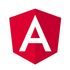
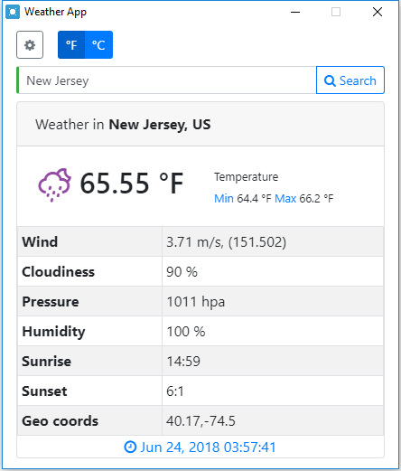
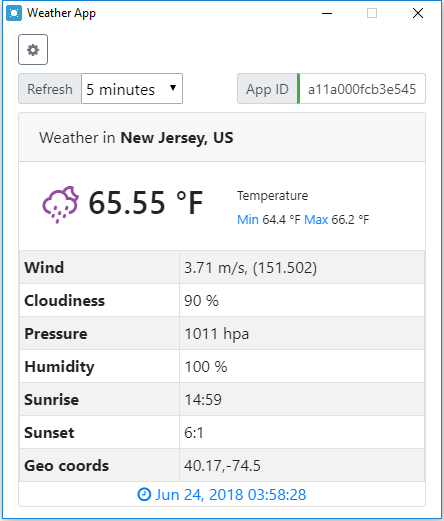

[](https://angular.io/) [](https://electron.atom.io/)


[](https://github.com/bhaumikpatel/Weather-App/blob/master/LICENSE.md)

[](https://twitter.com/intent/tweet?text=Wow:&url=https%3A%2F%2Fgithub.com%2Fbhaumikpatel%2FWeather-App)


# Introduction

Bootstrap and package your project with Angular 6(+) and Electron (Typescript + SASS + Hot Reload) for creating Desktop applications.

 


Currently runs with:

- Angular v6.0.3
- Angular-CLI v6.0.3
- Electron v2.0.1
- Electron Builder v20.13.4

With this sample, you can :

- Run your app in a local development environment with Electron & Hot reload
- Run your app in a production environment
- Package your app into an executable file for Linux, Windows & Mac

## Getting Started

Clone this repository locally :

``` bash
git clone https://github.com/bhaumikpatel/Weather-App.git
```

Install dependencies with npm :

``` bash
npm install
```

There is an issue with `yarn` and `node_modules` that are only used in electron on the backend when the application is built by the packager. Please use `npm` as dependencies manager.


If you want to generate Angular components with Angular-cli , you **MUST** install `@angular/cli` in npm global context.  
Please follow [Angular-cli documentation](https://github.com/angular/angular-cli) if you had installed a previous version of `angular-cli`.

``` bash
npm install -g @angular/cli
```

## To build for development

- **in a terminal window** -> npm start  

Voila! You can use your Angular + Electron app in a local development environment with hot reload !

The application code is managed by `main.ts`. In this sample, the app runs with a simple Angular App (http://localhost:4200) and an Electron window.  
The Angular component contains an example of Electron and NodeJS native lib import.  
You can desactivate "Developer Tools" by commenting `win.webContents.openDevTools();` in `main.ts`.

## Included Commands

|Command|Description|
|--|--|
|`npm run ng:serve`| Execute the app in the browser |
|`npm run build`| Build the app. Your built files are in the /dist folder. |
|`npm run build:prod`| Build the app with Angular aot. Your built files are in the /dist folder. |
|`npm run electron:local`| Builds your application and start electron
|`npm run electron:linux`| Builds your application and creates an app consumable on linux system |
|`npm run electron:windows`| On a Windows OS, builds your application and creates an app consumable in windows 32/64 bit systems |
|`npm run electron:mac`|  On a MAC OS, builds your application and generates a `.app` file of your application that can be run on Mac |

**Your application is optimised. Only /dist folder and node dependencies are included in the executable.**

## Browser mode

Maybe you want to execute the application in the browser (WITHOUT HOT RELOAD ACTUALLY...) ? You can do it with `npm run ng:serve`.  
Note that you can't use Electron or NodeJS native libraries in this case. Please check `providers/electron.service.ts` to watch how conditional import of electron/Native libraries is done.

## Error with nodejs third party packages

Since Angular 6 does not provide an eject anymore, you can't configure your webpack config file to import node externals.

An issue in [Angular repository](https://github.com/angular/angular-cli/issues/10681) is opened about this feature. 

Please have a look at [Stack Overflow Post workaround](https://stackoverflow.com/questions/50234196/after-updating-from-angular-5-to-6-i-keep-getting-the-error-cant-resolve-timer) that may work in some cases. Or use branch [angular5](https://github.com/maximegris/angular-electron/tree/angular5) and continue to eject your configuration file.

## Branch & Packages version

- Angular 4 & Electron 1 : Branch [angular4](https://github.com/maximegris/angular-electron/tree/angular4)
- Angular 5 & Electron 1 : Branch [angular5](https://github.com/maximegris/angular-electron/tree/angular5)
- Angular 6 & Electron 2 : (master)


